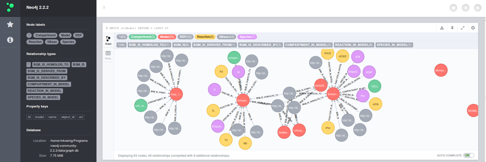

# neo4sbml - RDF metadata graph for SBML

## Introduction
Standard formats for the description of computational models in biology are important in the context of reproducible research, the communication of model content and intention and the documentation of models. Annotations play an important role in this documentation, providing the information what the individual model components are. The de facto standard for describing computational models is the Systems Biology Markup Language (SBML) with its annotations meta information encoded in RDF.

Questions we wanted to answer were:
* How well are the currently available computational models annotated?
i.e. which parts of the model are annotated and with which information?
* Which annotations occur in many models and is shared between models?
i.e. either which information is annotated very often or which elements occur in many models?

We analysed these questions by the means of a graph database representing the available relationships between model components (C) and their annotations (A), i.e. the graph
`(C) <-[:ANNOTATED]- (A)`.

This project was realized within the Berlin [neo4j-hackathon](https://gist.github.com/jexp/6ca5c8b528b8080fa63f) mentored by Michael Hunger with [neo4j](http://neo4j.com/).

## Description
The main project focus was the generation of the `(C) <-[:ANNOTATED]- (A)` graph database for available models in SBML format. We used the curated computational models in Systems Biology Markup Language (SBML) and their available annotation information in RDF consisting of 575 models in the 29th BioModels release available for download from http://www.ebi.ac.uk/biomodels-main/.

The graph consists of two main components:
First the SBML model structure graph which represents the `Model`, the `Compartment`, the `Species` and the `Reaction` nodes of the individual models, with model components connected to their respective `Model` via the following relationships
* `COMPARTMENT_IN_MODEL`
* `SPECIES_IN_MODEL` 
* `REACTION_IN_MODEL`

All model components have the additional label `SBase`.
The additional available relationships between model components can be added in a future version.

The second main components are the `RDF` annotations which are connected via their respective relationship types. Every model component can have multiple associated `RDF` nodes.
```
BQB = {
    0: 'BQB_IS',
    1: 'BQB_HAS_PART',
    2: 'BQB_IS_PART_OF',
    3: 'BQB_IS_VERSION_OF',
    4: 'BQB_HAS_VERSION',
    5: 'BQB_IS_HOMOLOG_TO',
    6: 'BQB_IS_DESCRIBED_BY',
    7: 'BQB_IS_ENCODED_BY',
    8: 'BQB_ENCODES',
    9: 'BQB_OCCURS_IN',
    10: 'BQB_HAS_PROPERTY',
    11: 'BQB_IS_PROPERTY_OF',
    12: 'BQB_HAS_TAXON',
    13: 'BQB_UNKNOWN',
}

BQM = {
    0: 'BQM_IS',
    1: 'BQM_IS_DESCRIBED_BY',
    2: 'BQM_IS_DERIVED_FROM',
    3: 'BQM_IS_INSTANCE_OF',
    4: 'BQM_HAS_INSTANCE',
    5: 'BQM_UNKNOWN'
}
```

## Implementation
The implementation is done in python using `libsbml` for parsing the SBML information and RDF annotations and `py2neo` for creating the cypher statements for creating the graph. So for creating the graph from scratch install the requirements and run the scripts in neo4sbml.

[py2neo](http://py2neo.org/2.0/)
[libsbml](http://www.sbml.org)

To work with the database copy the `graph.db` folder in this git into neo4j and restart the database server.

## Results
The resulting graph is available in the `graph.db` subfolder.
The graph database generating script can be found in `core.sbml2neo.py` using the information from the 575 SBML models in the data directory.



### Example queries

```
// In total 575 curated models should be in the database
MATCH (n:Model) RETURN COUNT(n)

// find the model annotations
MATCH (r:RDF)-[]-> (m:Model) RETURN m.id, r.uri

// which models have the most annotations
MATCH (r:RDF)-[]-> (m:Model) RETURN m.id, count(m.id) ORDER BY count(m.id) DESC

// which annotations are used most often
MATCH (r:RDF)-[]-> (s:SBase) RETURN r.uri, count(s.id) ORDER BY count(s.id) DESC

// look at interesting ones
// C00562 : Phosphoprotein
MATCH ( (r:RDF) -[]-> (s:SBase))
WHERE r.uri="http://identifiers.org/kegg.compound/C00562"
RETURN (r)-[]-> (s)

// Everybody is modeling MAP kinase pathway (http://identifiers.org/uniprot/Q02750)
MATCH ( (r:RDF) -[]-> (s:SBase))
WHERE r.uri="http://identifiers.org/uniprot/Q02750"
RETURN (r)-[]-> (s)

// find the corresponding models
MATCH ( (r:RDF) -[]-> (s:SBase) -[]-> (m:Model))
WHERE r.uri="http://identifiers.org/uniprot/Q02750"
RETURN (r)-[]-> (s)-[]->(m)
```

